# 2025's 15 Best Health and Fitness Coaching Platforms (Recent Update)

Sticking to a wellness routine isn't about discovering the perfect workout or meal plan—it's about finding tools that actually fit your life. People crave platforms that blend workouts, nutrition guidance, and support into one space without needing three apps, a personal chef, and a miracle. Whether you're someone trying to escape yo-yo dieting or a busy professional tired of skipping gym sessions, health and fitness coaching platforms promise faster habit formation, more consistent progress, and wider lifestyle coverage.

## [BetterMe](https://betterme.world)

Your all-in-one health companion blending workouts, meal tracking, and mindset shifts for people tired of juggling separate tools.

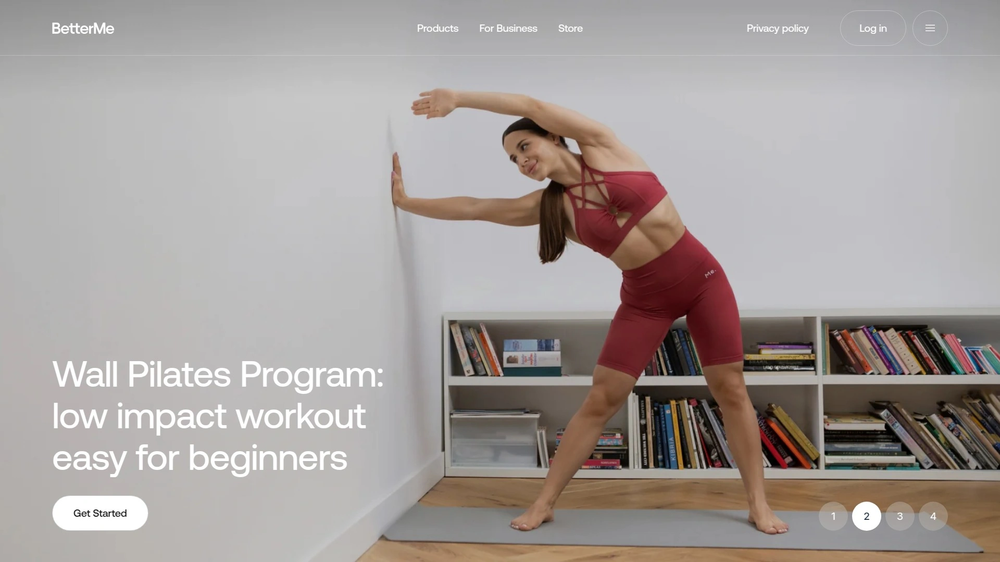

At the core, BetterMe merges personalized fitness plans with meal guidance and mental health resources into one accessible app. After answering onboarding questions about your fitness level and goals, the platform generates custom workout plans featuring everything from wall Pilates to HIIT, calisthenics to yoga. These workouts range from 12 to 30 minutes with video demonstrations ensuring proper form.

Meal planning becomes simpler with customizable plans based on dietary preferences like vegan, keto, or balanced diets, complete with grocery lists and meal prep tips. Mental wellness gets attention through guided meditations, mindfulness exercises, and stress-management resources.

Progress tracking covers workouts, meals, fasting hours, water intake, and step counts. You can integrate with Apple Health and Google Fit for comprehensive monitoring. Optional one-on-one coaching provides professional guidance and daily check-ins for users wanting extra accountability. The variety of accessible workouts—including routines for back pain relief, wheelchair fitness, post-pregnancy, and senior-friendly movement—makes this platform unusually inclusive.

## [Noom](https://www.noom.com)

Psychology-based weight management focusing on behavior change rather than restrictive dieting.

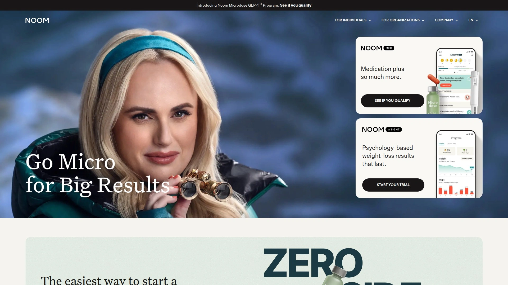

Noom uses a color-coded food system encouraging more green foods (vegetables, whole grains), moderate yellow foods (lean meats, starches), and limited orange foods (desserts, red meat). Tools allow meal logging, exercise tracking, body weight monitoring, and biometric data like blood sugar and blood pressure.

New features include AI-powered food logging with Welli assistant, Noom 360 Body Scan for instant health insights, Noom Vibe for habit tracking and wellness competition, Noom Mood for stress management, and Noom Move with 1,000+ fitness classes. Virtual coaching teams provide support through video chats, phone calls, and in-app messaging. The platform creates calorie budgets based on your profile and encourages daily step goals with activity logging. Subscriptions run monthly or annually with app integration to Fitbit, Garmin, and Apple Health devices.

## [MyFitnessPal](https://www.myfitnesspal.com)

Extensive food database and calorie tracking for users wanting detailed nutrition insights paired with exercise logging.

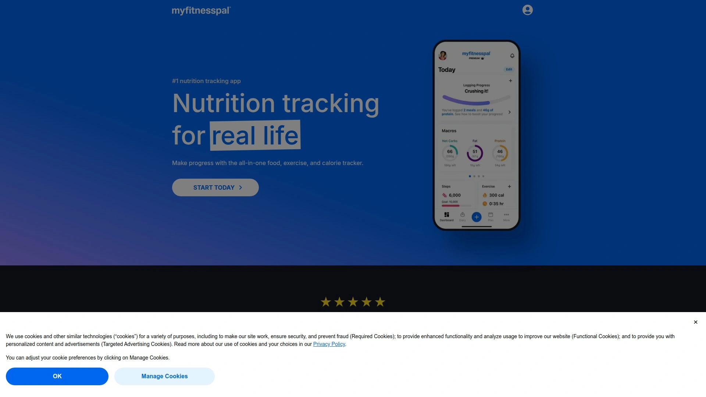

MyFitnessPal offers a massive food database for logging meals and tracking macronutrients. Step tracking works through your phone's motion-detecting chip or integration with activity trackers like Fitbit and Garmin. The platform calculates calorie adjustments based on your actual activity level versus your profile settings, creating exercise entries that update throughout the day.

Workout Routines let you build multi-exercise libraries based on your personal regimen, with strength exercises now counting toward caloric expenditure when logged under this feature. Users can set custom goals, track progress charts, and sync data with MapMyRun and MapMyWalk for comprehensive workout stats. The interface supports both free basic tracking and premium features including advanced reporting, meal planning targets, and barcode scanning.

## [Lose It!](https://www.loseit.com)

Calorie counting and weight loss tracking made simple with AI-powered logging features.

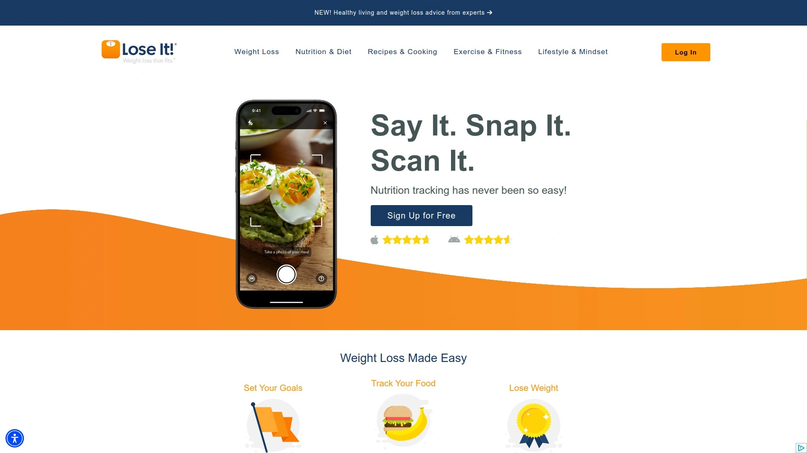

Lose It! generates personalized daily calorie budgets based on your profile and lifestyle. AI Voice logging lets you speak meals into your phone, while Photo Meal Logging allows you to snap pictures for instant calorie tracking. The app's database contains over 32 million foods and exercises with personalized search rankings based on your logging history.

Connect with friends, join support groups, and participate in community challenges for motivation. Premium features include barcode scanning, intermittent fasting tracking, advanced macro tracking (protein, carbs, fat, sugar), blood pressure monitoring, body measurements, and custom meal planning. Integration with fitness trackers and scales like Fitbit, Misfit, Garmin, and Withings allows automatic data syncing. The app includes offline search functionality and goal tracking with streak celebrations.

## [Centr](https://centr.com)

Chris Hemsworth's holistic health platform combining strength training, meal planning, and mindfulness in one organized space.

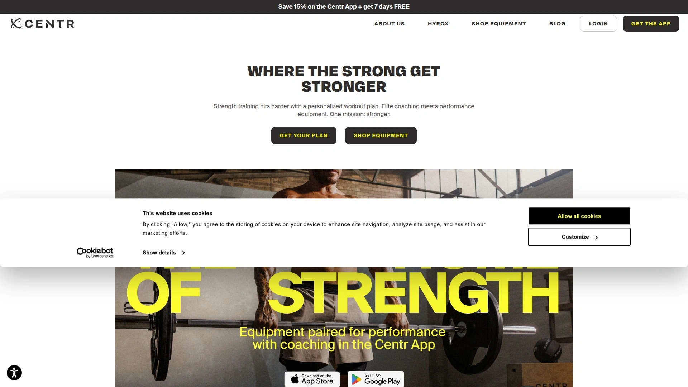

Centr provides personalized workout plans created by Chris Hemsworth's expert team of trainers and nutritionists. The flagship Centr Power program spans 13 weeks with progressive overload for muscle building, available for home or gym use. Workout variety includes strength training, bodyweight exercises, yoga, Pilates, HIIT, and functional training ranging from 20-30 minutes.

Meal planning features generate recipes based on dietary preferences with grocery lists and prep tips. Meditation exercises address mental health alongside physical training. Programs run 3 to 13 weeks with the ability to repeat while increasing weights. Equipment filtering lets you customize based on available gear. While the app lacks interactive accountability features and live classes, it integrates with Apple Watch for workout and activity monitoring. Subscriptions cost monthly, quarterly, or annually with all options under $30 per month.

## [Peloton App](https://www.onepeloton.com/app)

Thousands of live and on-demand classes across multiple workout types without requiring Peloton equipment.

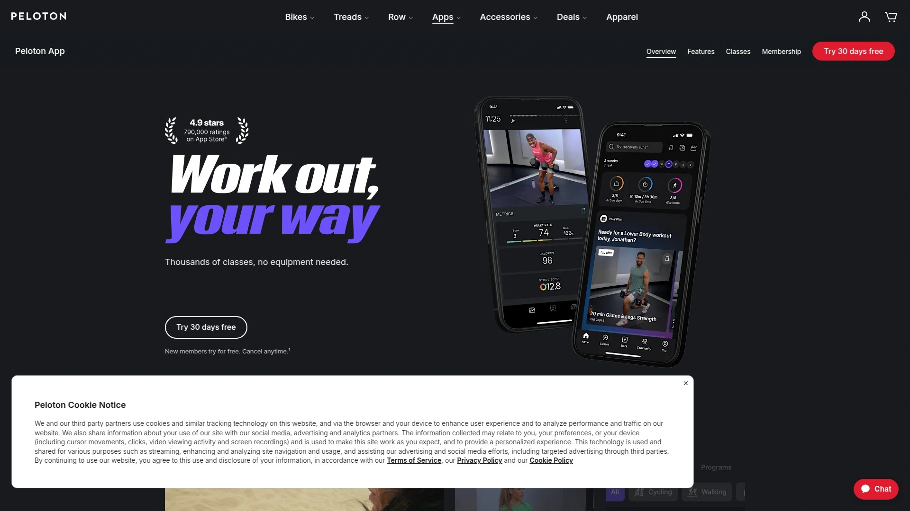

Peloton App offers strength training, yoga, HIIT, outdoor running, cycling, Pilates, meditation, and stretching classes ranging from 5-90 minutes. Peloton IQ provides AI-powered personalized workout plans, performance insights, and next-step recommendations. Peloton Official Teams let you connect with others, share milestones, and stay motivated through community.

Club Peloton rewards you with points for showing up regardless of speed or strength, moving through levels from Bronze to Legend. Real-time metrics help you track progress with streaks and personal bests. The app works on any equipment or no equipment at all, accessible on Apple and Android phones, tablets, Fire TVs, Roku, Sky TV, and Apple TV. Subscriptions include App One for general workouts and App+ for equipment-specific training, with monthly or annual billing options.

## [FitOn](https://fitonapp.com)

Free fitness platform with celebrity trainers offering unlimited workouts, meditation, and social features.

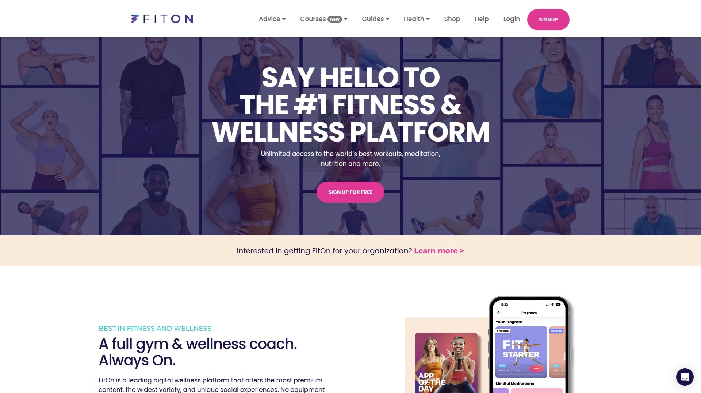

FitOn provides free access to cardio, yoga, strength training, Pilates, HIIT, Barre, dance, and toning workouts led by celebrity trainers like Cassey Ho (Blogilates), Jeanette Jenkins, and exclusive content with Gabrielle Union, Julianne Hough, and Jonathan Van Ness. No equipment needed for most routines, making home workouts accessible.

Personalized programs help you reach goals for weight loss, muscle building, toning, or stress reduction. Guided meditations address stress, anxiety, breathing, and sleep. Stay motivated through live leaderboards, progress tracking, and real-time messaging with friends or workout partners. The app integrates with Apple Watch, Fitbit, Samsung Watch, Whoop, Oura, and Garmin for real-time heart rate monitoring. FitOn PRO offers personalized meal plans, 500+ exclusive recipes, unlimited offline downloads, premium music, and enhanced heart rate zones. Compatible with WearOS devices for monitoring on the go.

## [Nike Training Club](https://www.nike.com/ntc-app)

Free expert-led workouts for gym, home, or outdoor training with professional guidance from Nike trainers and athletes.

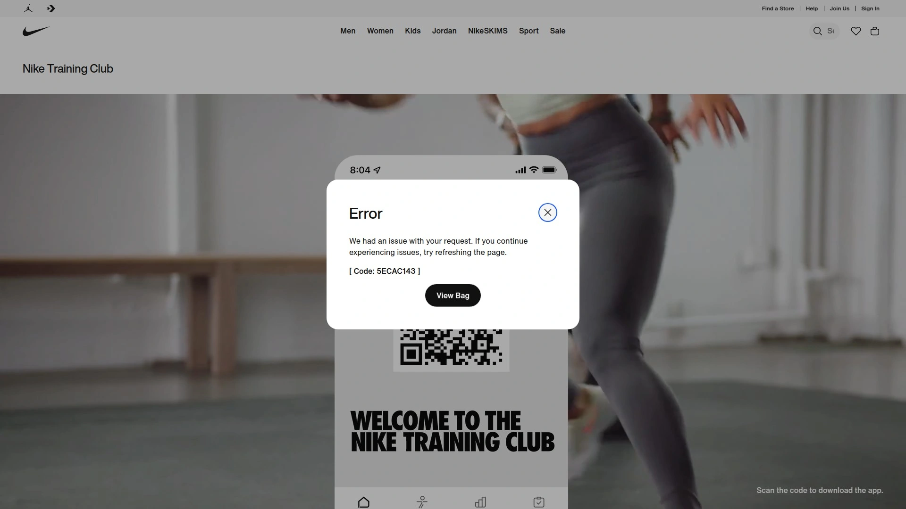

Nike Training Club grants free access to strength training, conditioning, yoga, Pilates, recovery, and mindfulness content. Expert programming includes gym workouts with curated strength routines, home workouts for small spaces and travel, total-body strength development, high-intensity interval training, core-focused sessions, and flexibility flows.

Workouts suit beginners through advanced levels with on-demand trainer-led classes or whiteboard workouts you follow independently. Multi-week programs help you train toward specific goals at your pace. Apple Watch support lets you focus on workouts while monitoring heart rate and calories burned from your wrist. Activity syncs automatically with Apple Health and Nike Run Club app. Video-on-demand classes available in US, UK, Brazil, Japan, China, France, Germany, Russia, Italy, Spain, Mexico, and South Korea.

## [Sweat](https://sweat.com)

Women-focused fitness platform featuring Kayla Itsines and world-class trainers with programs for home or gym.

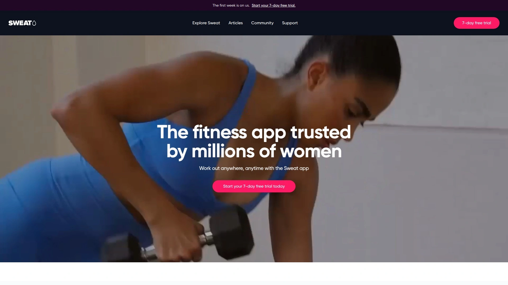

Sweat delivers 19 different training programs including Kayla Itsines' signature OG Kayla, Strength with Kayla, High Intensity with Kayla, HIIT, circuit training, bodyweight exercises, powerbuilding, yoga, Barre, Pilates, recovery, cardio, and pregnancy/postnatal options. Workouts adapt to no equipment, free weights, or machines with express sessions for time-crunched schedules.

Schedule workouts in advance with the Planner section and enable notifications for reminders an hour before sessions. Swap out moves you dislike or lack equipment for pre-workout with comprehensive video and text explainers ensuring proper form. Healthy eating plans accommodate pescetarian, vegetarian, lacto-vegetarian, ovo-vegetarian, and vegan diets with complete recipes. Spotify and Apple Music integration keeps your preferred tunes playing. Connect with a global community of women for challenges and support.

## [Alo Moves](https://www.alomoves.com)

Premium yoga, fitness, and mindfulness platform from the Alo Yoga brand with 80+ instructors.

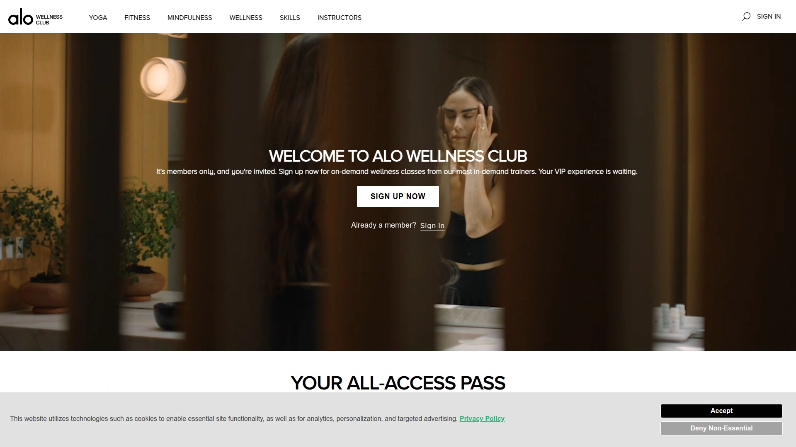

Alo Moves offers extensive yoga classes including vinyasa, hatha, ashtanga, and kundalini alongside HIIT, Barre, Pilates, strength training, meditation, breathwork, nutrition guidance, and personal growth content. Classes range from 10-minute shoulder stretches to 78-minute Ashtanga series with beginner-friendly tutorials and advanced workshops for arm balances and inversions.

Filter classes by type, difficulty, length, or instructor with playlists tailored to specific goals like better sleep or improved focus. Music is optional for each class. The platform provides foundational pose tutorials and skill-specific series with both 1-minute quick tips and 10-minute in-depth sessions. Subscriptions cost around $13 monthly or $130 annually. While the app lacks live classes, its on-demand library accommodates yoga enthusiasts at every level with user-friendly navigation.

## [8fit](https://8fit.com)

Integrated fitness and nutrition app combining HIIT workouts with customized meal plans.

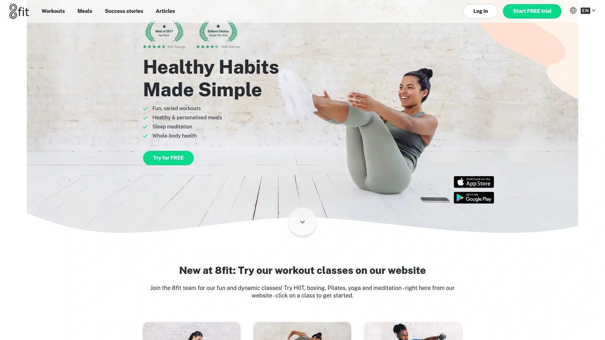

8fit creates customized workout routines and meal plans based on a detailed onboarding quiz capturing goals, physical attributes, and preferences. Over 350 exercises feature across various fitness levels with time-efficient HIIT workouts including tabata timers and countdown cues. Fitness assessments place you at the right initial level with workout plans designed to challenge and progress you.

Meal planning accommodates paleo, vegetarian, vegan, pescatarian, and low-carb preferences with over 400 healthy recipes customized to personal tastes or allergies. Organized weekly meal plans come with grocery lists eliminating calorie counting hassles. The app syncs with Google Fit and Apple Health as a pedometer and step counter. Workouts take 15-20 minutes and can be done at home without special equipment. Premium subscribers access all meal planning features, ingredient alternatives, extensive customization, and shopping lists.

## [Future](https://future.co)

One-on-one remote personal training matching you with expert coaches who build custom programs.

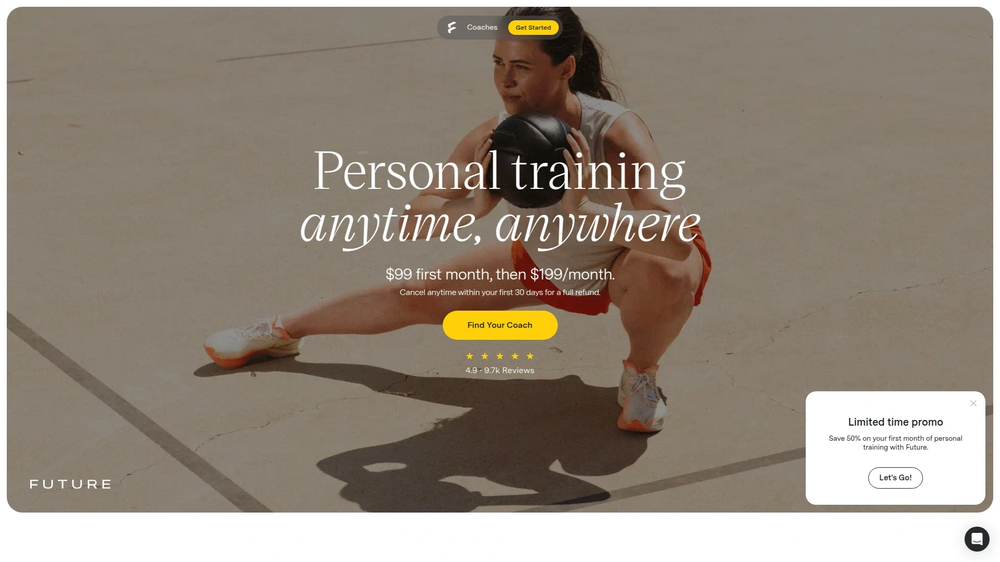

Future connects you with a world-class personal trainer who creates custom programs based on your goals, fitness level, and available equipment. Your coach provides unlimited communication through chats, adjusts your schedule for travel or busy days, and offers form checks whenever needed.

New features include progress reports tracking all-time performance and week-over-week improvement, an exercise library with 2,000+ guided movements covering complex gym equipment and bodyweight exercises, and social sharing with custom visual reports after each workout. Weekly training plans are built specifically for you with no two members having identical workouts. Rest days integrate into your plan along with activities you enjoy like cardio classes, yoga, or spontaneous hikes.

Apple Watch and Google Pixel Watch integration monitors workouts and activity holistically. Flexible training fits home, gym, outdoor, or travel scenarios. Memberships cost $199 monthly with a $99 first-month discount.

## [Aaptiv](https://aaptiv.com)

Audio-based fitness app with AI-powered SmartCoach creating hyper-personalized workout plans.

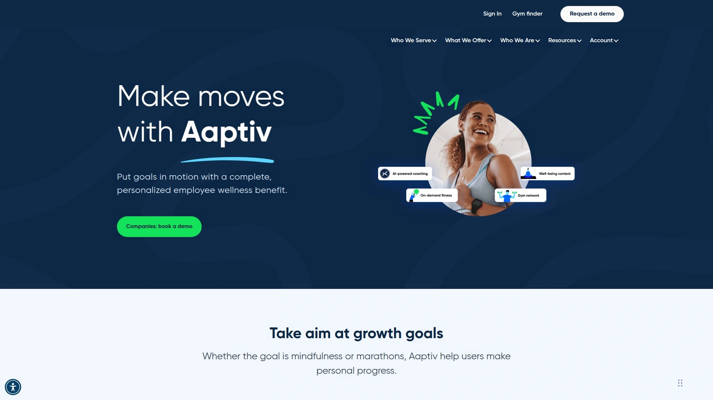

Aaptiv delivers over 10,000 on-demand audio and video workouts covering running, walking, elliptical, strength training, stretching, yoga, and rowing. SmartCoach uses AI to ask about your age, physical ability, and goals then creates tailored workout plans acting as your pocket personal trainer.

Heart rate zone training pairs with smart devices for on-screen feedback keeping you in optimal zones for maximum effectiveness. Multi-week programs and challenges target specific fitness goals like conquering a 5K, building muscle, or weight loss. Listen to your own music while trainers guide you through workouts, or tap specially curated playlists for motivation.

Community Feed lets you capture progress selfies and share with like-minded fitness enthusiasts for inspiration and support. Stats tracking monitors accomplishments and improvements over time with a personal dashboard of success. Subscriptions run $14.99 monthly or $99.99 annually with a 30-day money-back guarantee for annual plans.

## [JEFIT](https://www.jefit.com)

Comprehensive gym workout planner and tracker for strength training with massive exercise database.

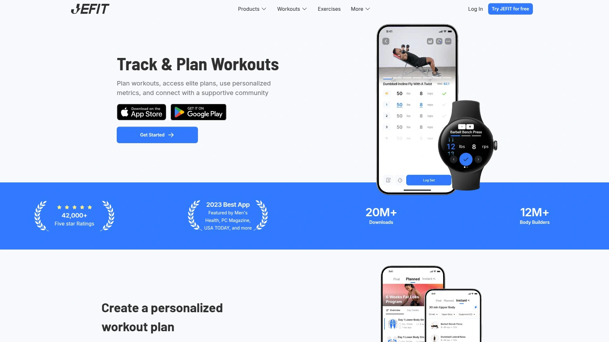

JEFIT provides a workout tracker for logging sets, reps, and weights with a custom gym workout planner featuring over 1,500 exercises and 850+ pre-built workout plans. HD video demonstrations ensure proper form across barbells, dumbbells, kettlebells, and cardio machines. One-tap workouts generate goal-based routines by muscle group, fitness level, or available time.

Progressive overload tracking with 1RM (one-rep max) estimation, advanced analytics, and strength performance monitoring help measure true strength levels. Smartwatch integration with Wear OS and Apple Watch allows hands-free logging directly from your wrist. Switch between pounds and kilograms with automatic syncing to your JEFIT account.

Join a global community of 12 million users sharing workout progress, gym milestones, and personal bests through strength challenges. Sync with Apple Health and Strava for comprehensive fitness tracking. Elite subscription ($69.99 yearly) unlocks unlimited smartwatch workouts, professional audio cues, advanced analytics, and premium training routines.

## [StrongLifts 5×5](https://stronglifts.com)

Simple strength training program using compound barbell exercises with proven 5×5 methodology.

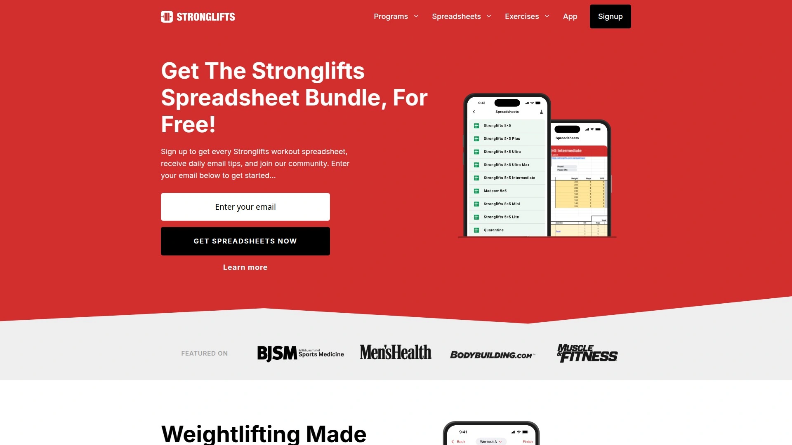

StrongLifts 5×5 consists of two alternating workouts featuring Squat, Bench Press, Overhead Press, Barbell Row, and Deadlift. Workout A includes Squat 5×5, Bench Press 5×5, and Barbell Row 5×5. Workout B features Squat 5×5, Overhead Press 5×5, and Deadlift 1×5. You train three times weekly with at least one rest day between sessions.

The 5×5 format means five sets of five reps with the same weight, while Deadlift uses one heavy set of five reps. Add weight when you complete five reps on all sets of an exercise, typically 5 pounds for upper body and 5-10 pounds for lower body. Full-body workouts hit all major muscle groups with compound exercises working several muscles simultaneously.

Each workout takes under an hour with simple progression tracking through the StrongLifts app. The app automatically alternates workouts, remembers your last session, adjusts weights, and includes a plate calculator showing which plates to add. Warm-up guidance and rest recommendations (about 3 minutes between sets) ensure safe progression. Free spreadsheets available for tracking your journey.

***

### FAQ

**Q: How do I choose between video-based and audio-based fitness apps?**
Video apps like BetterMe and Peloton work well when you want visual form cues and structured follow-along sessions. Audio apps like Aaptiv suit outdoor workouts or users who prefer exercising without watching a screen.

**Q: Can these platforms accommodate dietary restrictions and allergies?**
Most apps including BetterMe, Noom, 8fit, and Sweat offer customizable meal plans supporting vegan, vegetarian, keto, paleo, gluten-free, dairy-free, and other dietary preferences with ingredient substitution options.

**Q: How much should I expect to invest monthly in a fitness coaching platform?**
Free options like FitOn and Nike Training Club exist alongside budget-friendly choices ($10-20 monthly for Noom, MyFitnessPal Premium, Alo Moves). Mid-range platforms like Sweat and Centr cost $20-30 monthly, while premium one-on-one coaching through Future runs $199 monthly.

---

Navigating your fitness journey in 2025 doesn't require complicated systems or endless willpower—just the right platform matching your goals and lifestyle. These fifteen health and fitness coaching options deliver real results through smart design, expert guidance, and genuine support. For those seeking a complete wellness package without the complexity, [BetterMe](https://betterme.world) delivers the ideal balance with its inclusive workouts, integrated meal planning, and mental health resources—perfectly suited for anyone craving sustainable progress and lasting habit change.
